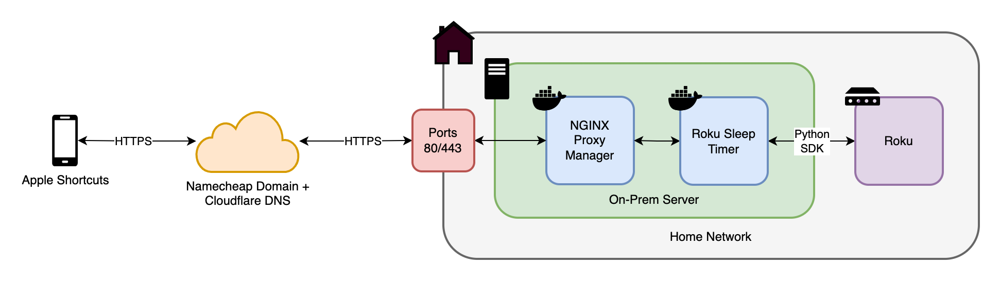

# Roku Sleep Timer
Turn off Roku and TV after specified period of time. Self hosted dockerized application using Python, Flask, Docker, and Docker Compose.

Companion repo to Medium article: `<LINK>`.

## Table of Contents
- [Overview](#overview)
- [Architecture](#architecture)
- [Application Routes](#application-routes)
- [Application Files](#application-files)
- [Prerequisites](#prerequisites)
- [Getting Started](#getting-started)
- [License](#license)

## Overview
This repo allows you to create and deploy a Roku Sleep Timer  application using Flask and Docker. Docker Compose is used to build the Docker image, inject environment variables, and act as a starting point to add additional services to your application.

## Architecture
The final architecture of this application is as follows:

This repo represents the `Roku Sleep Timer` block in the diagram. It will be invoked via an HTTP request from some source (in this case Apple Shortcuts), routed via Cloudflare and NGINX Proxy Manager, and finally interact with the Roku via a Python SDK.

## Application Routes
The routes defined in the Flask app are as follows:
| Endpoint  | Description |
| ------------- | ------------- |
| `/`  | Test connection - will return `Connected` if successful. |
| `/host`  | Returns IP Address of Roku device. |
| `/on`  | Manually turn Roku + TV on. |
| `/off`  | Manually turn Roku + TV off. |
| `/discover`  | Start discovery for Roku on the network and re-sync. |
| `/start/<int:minutes>`  | Starts job to sleep in `<minutes>` number of minutes.  |
| `/stop`  | Cancel all sleep timer jobs. |

## Application Files
This repo contains the following files and directories:
- `src/`: Directory for source code - will be copied into Docker image
    - `src/app.py`: Definition of application routes
    - `src/roku_sleep_timer.py`: Python code to control Roku via SDK
- `default.env`: Default environment file for secret management - should be renamed to `.env` and never checked into source control
- `docker-compose.yml`: Default Docker Compose file that injects secrets from `.env` file and builds Docker image specified by `Dockerfile`
- `Dockerfile`: Default Dockerfile that copies source code, installs Python dependencies, and runs Flask server
- `Makefile`: Helper to easily start, stop, and restart app
- `requirements.txt`: Defines list of Python requirements that are used by the application and will be installed into the Docker image

## Prerequisites
Ensure you have [Docker](https://docs.docker.com/get-docker/), [Docker Compose](https://docs.docker.com/compose/install/), and [Python](https://www.python.org/downloads/) installed.

## Getting Started
1. Clone the repository.
1. Copy the `default.env` file to a new file called `.env` and populate with your desired port and any secrets
    - This should never be commited into source control - this template is setup to ensure the `.env` file is excluded from Git
1. Deploy the app by running `make up`.
1. Navigate to `http://<IP_ADDRESS>/<FLASK_PORT>` (e.g. [http://localhost:5050](http://localhost:5050)) in your browser - you should see `Connected` if successful. 
    - `IP_ADDRESS` is the IP address of the machine running Docker.
    - `FLASK_PORT` is the port defined in your `.env` file (default is 5050)
1. Update app with any changes by re-running `make up`
1. Restart app by running `make restart`
1. Stop app by running `make down`
1. Follow medium article `<HERE>` to setup connectivity outside your local network

## License
This template is made available under a modified MIT license. See the LICENSE file.